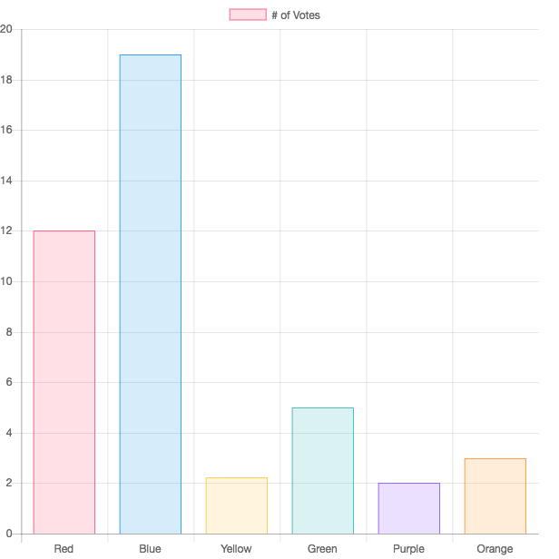

# Streaming Visualization

Visualize real-time data, powered by Javascript plots + Flask-SocketIO.

## Get Started

```bash
$ python app.py
```

Be sure `debug` is set to `False` to ensure server uses `eventlet` as the asynchronous server. This will support multiple clients. 

## Dynamically Updating Bar Chart

The example includes a random stream for the number of yellow votes:



